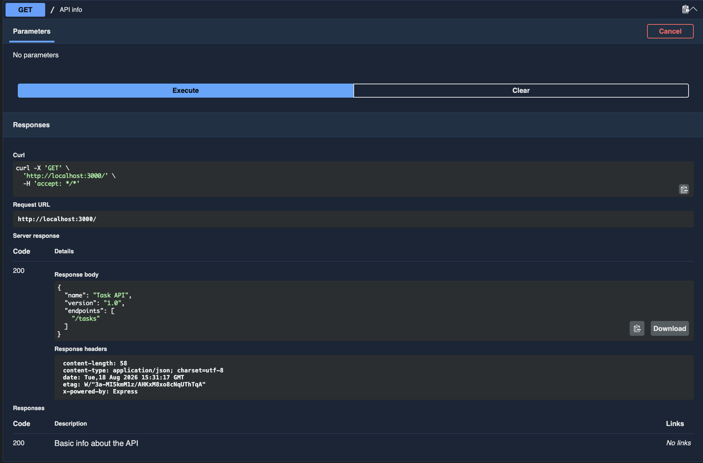
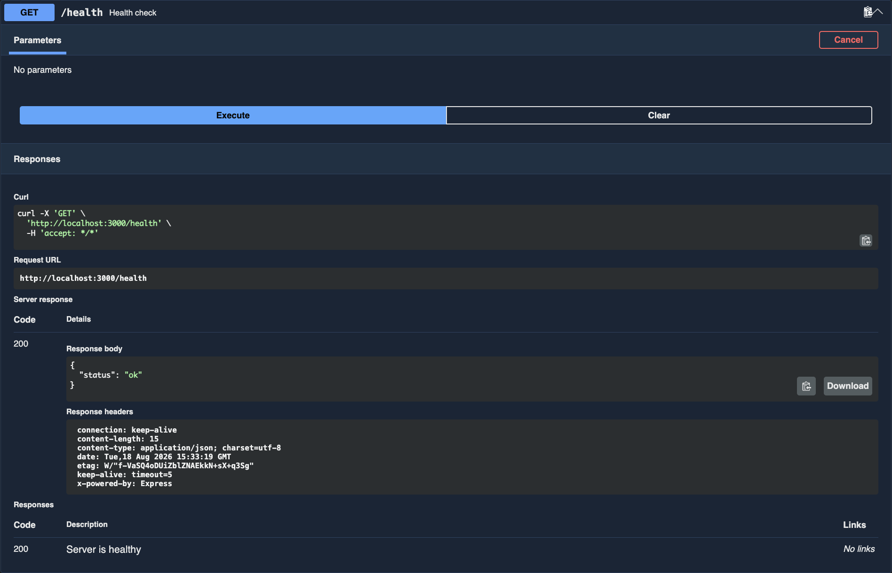
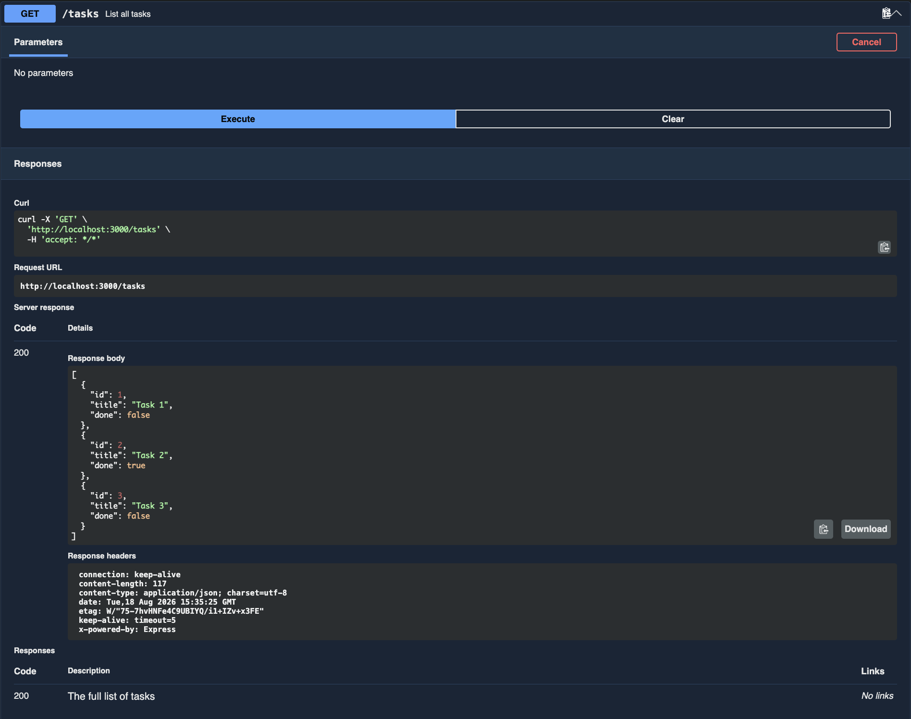
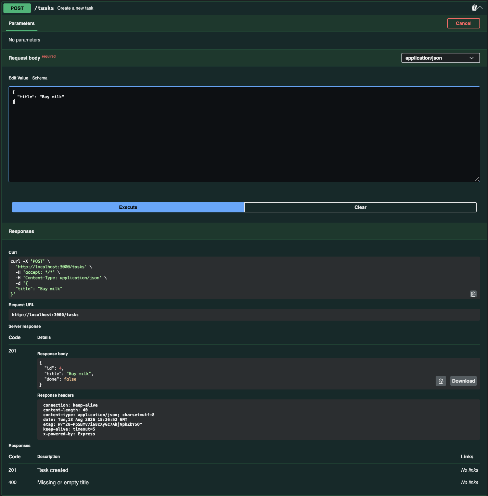
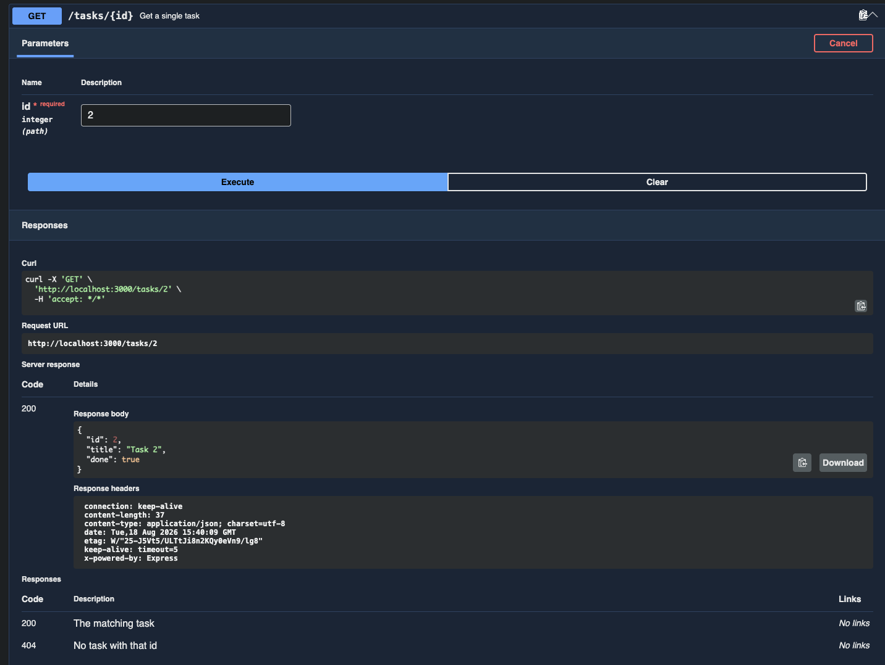
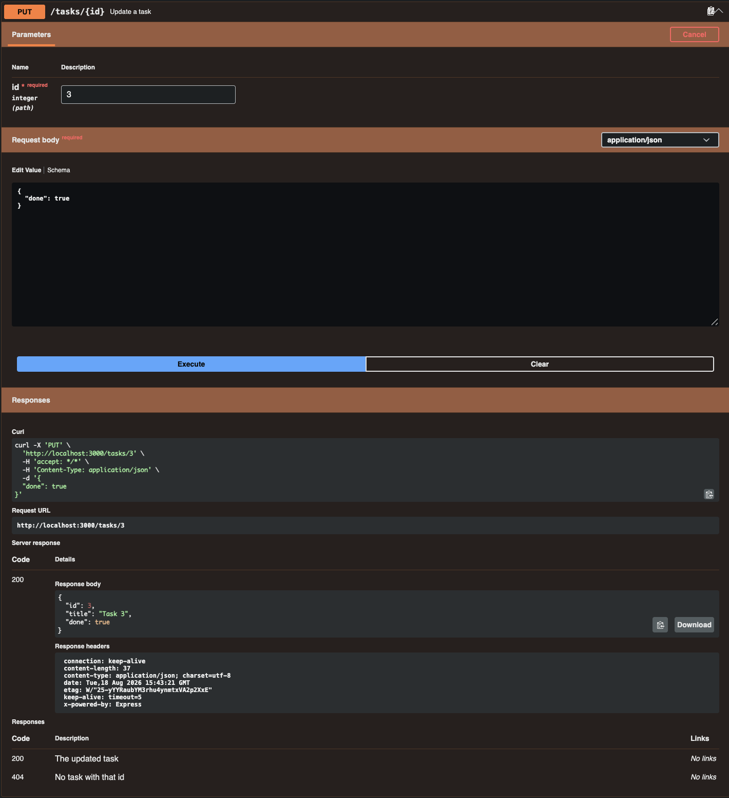
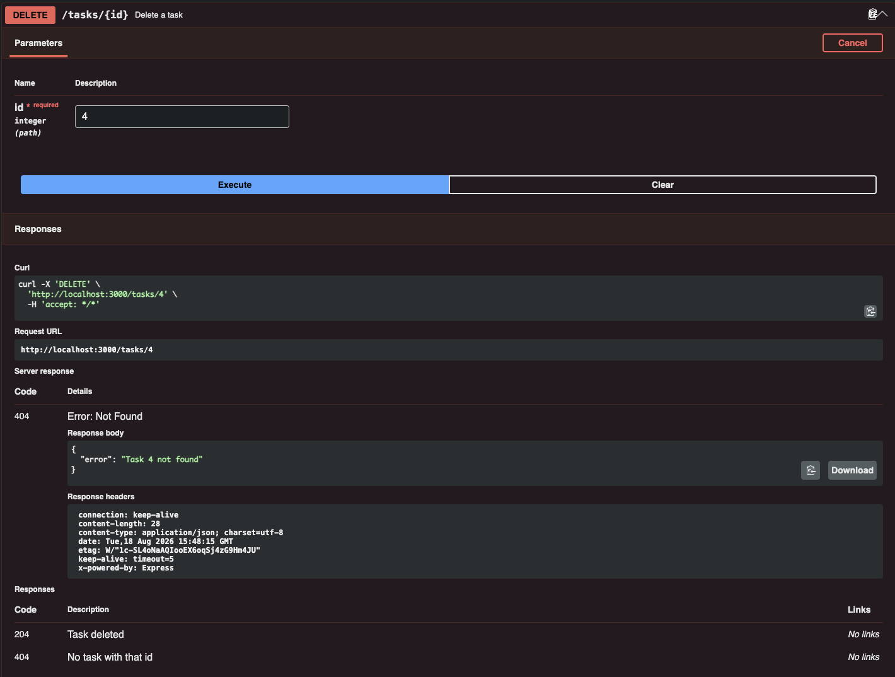
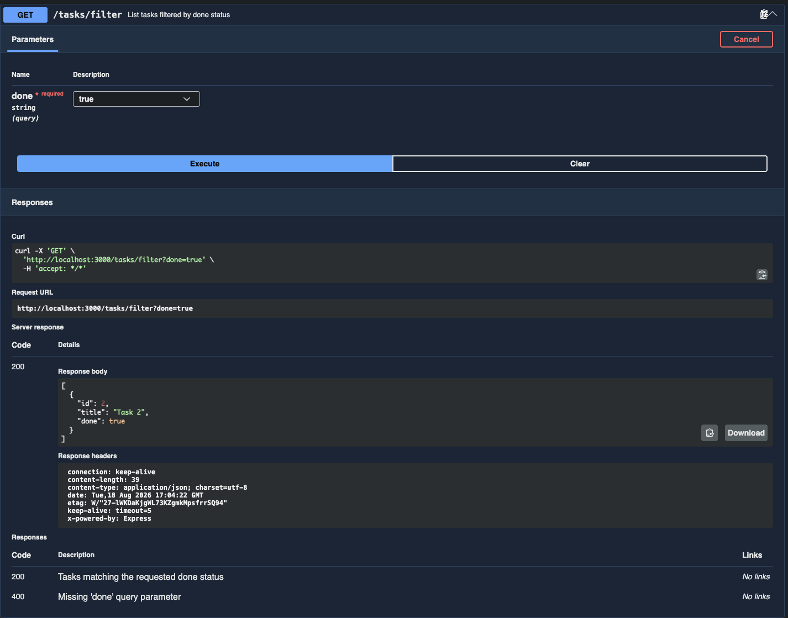

# Simple To-Do List CRUD API

A small to-do list API built with Node.js and Express — create, read, update, and delete tasks, with in-memory storage and interactive Swagger UI docs.

Built as Week 2 Assignment A1 of the [FlyRank Backend Internship](https://internship.flyrank.ai/) (JavaScript lane).

## Install & run

```
npm install
npm start
```

The server starts on `http://localhost:3000`.

## Endpoints

| Method | Path          | Description                          | Success | Errors    |
|--------|---------------|---------------------------------------|---------|-----------|
| GET    | `/`           | API info                              | 200     | —         |
| GET    | `/health`     | Health check                          | 200     | —         |
| GET    | `/tasks`      | List all tasks                        | 200     | —         |
| POST   | `/tasks`      | Create a task (`{ "title": "..." }`)  | 201     | 400       |
| GET    | `/tasks/:id`  | Get a single task                     | 200     | 404       |
| PUT    | `/tasks/:id`  | Update a task's `title` and/or `done` | 200     | 400, 404  |
| DELETE | `/tasks/:id`  | Delete a task                         | 204     | 404       |

## Extras

| Method | Path                     | Description                                  | Success | Errors |
|--------|--------------------------|-----------------------------------------------|---------|--------|
| GET    | `/tasks/filter?done=true` | List tasks filtered by `done` (`true`/`false`) | 200     | 400    |

## Example request

```
curl -i http://localhost:3000/tasks/1
```

```
HTTP/1.1 200 OK
X-Powered-By: Express
Content-Type: application/json; charset=utf-8
Content-Length: 38
ETag: W/"26-aKst2jrzuFjYdRudlan+1nM7StI"
Date: Tue, 18 Aug 2026 15:27:54 GMT
Connection: keep-alive
Keep-Alive: timeout=5

{"id":1,"title":"Task 1","done":false}
```

## Swagger UI

Interactive docs (with a "Try it out" button for every endpoint) are served at:

```
http://localhost:3000/docs
```

| Endpoint | Screenshot |
|---|---|
| `GET /` |  |
| `GET /health` |  |
| `GET /tasks` |  |
| `POST /tasks` |  |
| `GET /tasks/:id` |  |
| `PUT /tasks/:id` |  |
| `DELETE /tasks/:id` |  |
| `GET /tasks/filter` |  |

## Data storage

Tasks live in an in-memory array — there's no database, so all data resets when the server restarts. Persistent storage arrives in a later assignment.
